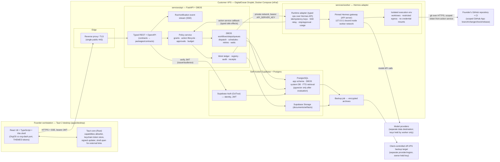

# Engine Labs — Release-1 Architecture

This document fixes the release-1 (intake phases 07 + 08) system shape so that phases 1–2 implement against one description and Security can review boundaries before code exists. It describes; it does not build (phase 0 non-goal). Every external claim about Hermes, DBOS, Tauri, or Supabase cites the documentation fetched on 2026-09-10; behaviour must be re-validated against pinned versions in the phase-1/2 compatibility spikes (NFR-10).

Documentation sources (fetch date 2026-09-10):

- Hermes Agent API server — <https://hermes-agent.nousresearch.com/docs/user-guide/features/api-server> (lead fetch, saved copy inspected by SE) — cited as **[HERMES-API]**.
- DBOS Python programming guide — <https://docs.dbos.dev/python/programming-guide> — **[DBOS-PY]**.
- Tauri 2 capabilities and security boundaries — <https://v2.tauri.app/security/capabilities/> (page dated Sep 3, 2026) — **[TAURI-CAP]**; Tauri 2 overview <https://v2.tauri.app/start/> — **[TAURI-START]** (lead fetch).
- Supabase self-hosting with Docker — <https://supabase.com/docs/guides/self-hosting/docker> — **[SUPA-DOCKER]**.

## 1. Component diagram



Reading the diagram: the desktop talks only to the Engine Labs API (PRD-B.5); the API is the single place where grants, action lifecycle, approvals and budgets are decided (PRD-D.5, E.3); DBOS gives the API durable dispatch (PRD-E.4/E.5); the worker wraps a pinned Hermes gateway behind a typed adapter and never receives production deployment credentials (PRD-B.10); identity and primary data live in the customer's self-hosted Supabase/Postgres (PRD-F.6); backups leave the VPS encrypted (PRD-F.6).

## 2. Components and responsibilities

| Component | Path (D-01) | Technology | Responsibilities (release 1) | Not responsible for |
|---|---|---|---|---|
| Public website | `apps/web` | Vite 6 + React 18 + TypeScript | Single public entry (company + OrgOS product) deployed on the `orgos` Vercel project | Auth, API, prices, Control Centre chat, collecting briefs |
| Desktop shell | `apps/desktop` | Tauri 2 (Rust core) + React 18 + TypeScript + Vite | OrgOS-derived shell (ui-blueprint §F), sign-in, views Home/Work/Runs/Connections/Settings, SSE client, keychain-stored token, signed updates, external-link handoff | Any provider credential, business logic, permission decisions, direct DB/filesystem access from generated views (PRD-D.13) |
| API | `services/api` | Python 3.11+, FastAPI, Pydantic models, DBOS (Python) | Authn (verify Supabase JWT), authz/grants, ledger, registry, audit/receipts, action lifecycle, approvals, budget reservation, job persistence and dispatch (DBOS), run event fan-out (SSE), notifications, usage ledger, health composite | Executing agent tools, storing provider keys, talking to GitHub directly (delegated to action service adapters inside API with scoped token) |
| Worker | `services/worker` | Python 3.11+ adapter process + pinned Hermes gateway container + execution sandbox | Typed operations over the Hermes API (§8), idempotent run creation, event relay, stop/approval, usage capture, tool interception callbacks to the action service, isolated worktrees | Deciding permissions; holding production deployment credentials; scheduling on its own authority (PRD-E.5) |
| Contracts | `packages/contracts` | OpenAPI (generated from FastAPI) → TypeScript client + zod schemas; shared event and view-definition schemas | Single typed contract between desktop and API; run/notification event schema; registry row schema (D-02) | Runtime code |
| UI package | `packages/ui` (proposed by ui-blueprint §F; sub-package of the monorepo) | TSX primitives, icons, tokens | Ported `primitives.jsx`/`icons.jsx` with a11y fixes; `THEMES` as single token source | Data fetching |
| Infra | `infra/` | Docker Compose, env templates (names only), backup scripts, Caddy/Traefik config, digests | Reproducible single-Droplet topology (§10), backup/restore (§11), health checks | Any production execution by agents (owner/CI only) |
| Data/identity | (Compose services under `infra/`) | Self-hosted Supabase (Auth, Postgres, Storage; PostgREST/Realtime/Studio optional) | Identity, JWT issuance, primary records, files, DBOS system DB, FTS retrieval | Application authorization (done in API; Supabase RLS is defence in depth, not the primary check) |

## 3. Monorepo layout (decision D-01, `accepted`)

Consistent with manifest §10 and phase plan §7. Rationale, alternatives and consequences are in `docs/decisions/2026-09-10-monorepo-layout.md`.

```
/                         # repository root (this repo; branch decision pending — manifest §13)
├── AGENTS.md, .cursor/   # governance (protected; unchanged)
├── docs/                 # blueprints, plans, decisions, workstreams, product docs
├── apps/
│   ├── desktop/          # Tauri 2 app: src-tauri/ (Rust, capabilities/*.json), src/ (React TS), vite.config.ts
│   └── web/              # Public Vite site (Vercel project `orgos`)
├── services/
│   ├── api/              # FastAPI + DBOS: app/, migrations/, tests/, pyproject.toml
│   └── worker/           # Hermes adapter: adapter/, policy_hooks/, tests/, pyproject.toml, hermes/ (pinned config, no secrets)
├── packages/
│   ├── contracts/        # openapi.json (generated), ts client, zod schemas, event schemas, registry schema
│   └── ui/               # primitives, icons, tokens (TSX) ported from .reference/orgos
├── infra/
│   ├── compose/          # docker-compose.yml + overrides (dev, prod), .env.example (names only)
│   ├── backup/           # backup/restore scripts and runbook
│   └── digests.lock      # pinned image digests (NFR-10)
├── .reference/orgos/     # pinned OrgOS clone (git-ignored; phase 0)
└── .gitignore
```

Tooling assumption (`provisional`): npm workspaces for `apps/desktop`, `packages/*`; `uv` or `pip-tools` lockfiles per Python service; one root `Makefile`/`justfile` for `dev`, `test`, `compose-up`. Fixed in the phase-1 plan after the Tauri + Vite + workspace spike.

## 4. Entities (release 1) — ownership, retention, deletion

Ownership: `tenant` = customer organisation data environment (PRD-F.6); `native` = Engine Labs schema in the tenant Postgres. Retention defaults from PRD-F.4 are configurable by the owner (P11). "Deletion" describes the R4 erasure behaviour (PRD-F.8) that the R1 schema must not preclude (soft-delete markers, cascade maps, and derived-artifact links exist from phase 1).

| Entity | Owner / store | Key fields (non-exhaustive) | Retention default | Deletion behaviour | Cite |
|---|---|---|---|---|---|
| Organisation, LegalEntity, Department, Team, Location | native (tenant PG) | ids, names, parent links | until superseded/erased | erased only by organisation-wide erasure (3 confirmations) | PRD-D.4 |
| Member | native + Supabase Auth user | auth_user_id, name, locale, timezone, status | until offboarding | offboarding revokes sessions/grants; record archived with owner + deadline | PRD-F.7 |
| Seat, SeatTemplate | native | template (Founder/PL/Operator), member_id, delegated_by | until revoked | revoke cascades to Grants | PRD-D.1–D.3 |
| Grant | native | class (`ledger.*`, `run.*`, `repo.*`, …), scope, expiry, delegated_by | until revoked/expired | revocation triggers authority recheck of running work | PRD-D.12 |
| ProviderAccount, Connector, RepositoryBinding | native (metadata only; credentials as references to the secret store) | provider, account scope, health, last_verified | until revoked | revocation → registry rows `unavailable`; credential reference deleted | PRD-A.6, A.9 |
| Capability (registry row) | native | D-02 columns | permanent (versioned) | never deleted; status only (PRD-C.5) | PRD-C.* |
| Project (plan), Task (assignment), Priority, Request, Dependency, Blocker | native (work ledger) | ids, status, owner, due, source refs | until superseded/archived | erasable in scope; loop chain links preserved as tombstones | PRD-A.3 |
| Decision, Evidence, Document, Version | native (+ Supabase Storage for files) | provenance, revision SHA, source permission snapshot | approved knowledge until superseded/deleted/expired by policy | erasure clears content, indexes, caches, replicas; receipt produced | PRD-F.4, F.8 |
| Agent | native | sponsor, purpose, model band, toolsets, budget ceiling, status | until retired | retire keeps audit | PRD-E.2 |
| Conversation (Session), Message | native (copy independent of Hermes storage) + Hermes session id reference | tenant, principal, mode, hermes_session_id, messages | **365 days** | expiry job deletes messages; Hermes session deleted via `DELETE /api/sessions/{id}` [HERMES-API] | PRD-E.10, E.12, F.4 |
| Job (DBOS workflow), Run, Step, Checkpoint, Claim | native app schema + DBOS system tables | workflow_id, run_id, hermes_run_id, idempotency_key, status, sponsor, acting identity, purpose, scope, policy_version, model config, budget, deadline, owner | run records until superseded; **execution/debug logs 30 days** | logs pruned at 30 d; run metadata retained; DBOS system rows pruned by workflow retention setting | PRD-E.2, E.7 |
| Action, Approval, Receipt | native | typed action, target + version, approver, decision time, source outcome | with the run's audit trail | never edited; erasure tombstones content but keeps hash | PRD-E.3, D.10 |
| AuditEvent | native (append-only) | actor, intent, input versions, policy version, tool outcome, record change | as long as the tenant exists (essential audit across tiers, PRD-G.7) | not deleted by scoped erasure; anonymised on organisation erasure with receipt | PRD-F.8 |
| MemoryItem | native (PG full-text; pgvector later) | kind, class (source/approved/inferred), provenance, owner, source permissions, timestamps, verification, expiry, version | per class policy; credentials never stored | delete cascades to derived summaries/embeddings; restriction propagates | PRD-F.1–F.3 |
| UsageEvent, MetricRecord | native | run_id, model band, tokens, tool calls, execution time, est. cost, provider event id (dedupe) | tenant lifetime (aggregated after 365 d) | aggregated, not individually erased (billing metadata) | PRD-G.3, G.11 |
| Notification | native | member, kind, deep link, read_at | 90 days (`proposal`) | pruned | PRD-E.4 |
| Preference (personal), SharedConfigVersion | native + desktop local cache | theme, rail, panel, filters; versioned org defaults | until member offboarding | personal deleted at offboarding; shared versions retained | PRD-A.10 |
| Backup archive | `infra/backup` → off-VPS target | encrypted dump + storage snapshot, manifest, key id (owner-held) | **30 days rotating** | rotation deletes; pending copies disclosed in erasure receipts | PRD-F.4, F.6 |

## 5. Trust boundaries

| # | Boundary | Crosses | Controls (release 1) | Threats for Security review |
|---|---|---|---|---|
| TB-1 | Desktop ⇄ API | Public internet; bearer JWT | TLS only; JWT verified with `ENGINE_JWT_ISSUER`/`ENGINE_JWT_AUDIENCE`; CORS origins `ENGINE_API_CORS_ORIGINS` limited to the Tauri origin; token in OS keychain via Tauri, never in web storage; Tauri capabilities allowlist minimal [TAURI-CAP]; desktop bundle contains no provider credential (static scan R1-ACC-7); updates signed (`TAURI_SIGNING_*`, CI only) | token theft, replay, XSS in webview, update tampering, capability over-grant |
| TB-2 | API ⇄ Postgres/Supabase | Private Compose network | `DATABASE_URL` and `SUPABASE_SERVICE_ROLE_KEY` only in API; row-level filters enforced in API for every read surface (records, search, aggregates, attachments, notifications, memory — PRD-D.5); RLS as defence in depth; Supabase Studio not exposed publicly (basic auth per [SUPA-DOCKER], bind to localhost/SSH tunnel) | privilege escalation via service-role key, SQL injection, Studio exposure |
| TB-3 | API/DBOS ⇄ Worker adapter | Private Compose network | Adapter accepts jobs only from the API's DBOS workflows; Hermes `API_SERVER_KEY` (`HERMES_API_SERVER_KEY`) held by worker/API only; Hermes bound to `127.0.0.1`/worker network, never published [HERMES-API "Security"] | lateral movement to Hermes toolset (full terminal access per [HERMES-API]) |
| TB-4 | Worker/Hermes ⇄ execution sandbox | Container/mount boundary | Least-privilege mounts (worktree only), no credential or orchestration-DB mounts (PRD-E.6), restricted egress allowlist (GitHub, model providers), separate agent profile per tenant [HERMES-API multi-profile] | prompt-injected file/shell actions, data exfiltration, credential discovery |
| TB-5 | Hermes tools ⇄ Engine Labs action service | In-process/hook callback | Side-effecting tools route through typed actions; API authentication is transport access, not per-tool authorisation (PRD-E.10); receipts persisted before external effect is considered complete (PRD-E.7) | bypass of action lifecycle, duplicate external effects |
| TB-6 | Action service ⇄ GitHub | Public internet; GitHub App installation token | Four grant classes (branch/change/check/release) checked server-side (PRD-B.2); release requires designated authority (PRD-B.4); tokens minted per action with minimal permissions; `GITHUB_APP_*` in API only | over-scoped token, release without approval, secret in worker |
| TB-7 | Hermes ⇄ model providers | Public internet | Provider keys (`MODEL_PROVIDER_API_KEY`) in worker only; provider = separate data destination with its own policy (PRD-F.5/F.6); no cross-tenant learning by default | content leakage, policy drift |
| TB-8 | VPS ⇄ backup target | Public internet, encrypted at rest | Encryption before leaving VPS; key owned by client (`BACKUP_ENCRYPTION_KEY_PATH`); target in separate provider/region (`BACKUP_TARGET_URL`); provider snapshots tracked separately | unencrypted export, key co-location, "local backup as DR" (prohibited) |
| TB-9 | Agents ⇄ security controls / production | Policy + hooks + CI | Agents cannot self-grant or modify security controls (PRD-D.11); production deployment credentials absent from worker env (PRD-B.10; test asserts denial); release execution only via owner/CI (PRD-B.11) | self-escalation, production mutation from dev loop |
| TB-10 | Identity namespaces | Data model | Cursor delivery roles, product seats, and Hermes runtime identities are distinct with no shared credential (PRD-B.9) | identity confusion, credential reuse |

## 6. Data-destination map (PRD-F.6)

| Destination | Data classes | Policy owner | Default policy | Configuration (names only) | Notes |
|---|---|---|---|---|---|
| Tenant Postgres (VPS) | primary records, ledger, conversations, memory, audit, usage, DBOS state | customer owner | stays on assigned VPS | `DATABASE_URL`, `DBOS_SYSTEM_DATABASE_URL`, `POSTGRES_PASSWORD` | Primary residency |
| Supabase Storage (VPS) | documents, artifacts, run outputs | customer owner | stays on VPS; Storage may be S3-backed only if the bucket is client-controlled [SUPA-DOCKER "Configuring S3 Storage"] | Supabase Storage config | |
| Supabase Auth (VPS) | identities, sessions | customer owner | stays on VPS | `SUPABASE_URL`, `SUPABASE_JWT_SECRET`, `SUPABASE_ANON_KEY` (desktop), `SUPABASE_SERVICE_ROLE_KEY` (API) | anon key is public by design; service-role key never on desktop |
| Hermes gateway state (VPS, worker) | session transcripts, stored responses (SQLite, max 100 LRU per [HERMES-API "Limitations"]), runtime memory files | Engine Labs runtime policy | scoped per tenant profile; company records never depend on it (PRD-E.10); pruned with conversation retention | `HERMES_API_BASE_URL`, `HERMES_API_SERVER_KEY`, `HERMES_VERSION_PIN` | duplicate of conversation content — covered by erasure |
| Model / tool providers (external) | prompts, retrieved context, tool inputs/outputs sent for inference | owner policy per provider (PRD-F.5) | configurable; fixtures until live-data permission recorded; no training/cross-customer use | `MODEL_PROVIDER_API_KEY` (per provider) | separate destination; backup permission does not authorise this |
| GitHub (external) | code changes, PR text, check results | owner (repository owner) | scoped by grant class | `GITHUB_APP_ID`, `GITHUB_APP_INSTALLATION_ID`, `GITHUB_APP_PRIVATE_KEY_PATH` | source of truth for code |
| Off-VPS backup target (external, client-controlled) | encrypted DB dump + storage archive | customer owner | encrypted; 30-day rotation; restore access owner-held | `BACKUP_TARGET_URL`, `BACKUP_ENCRYPTION_KEY_PATH` | provider snapshots tracked separately |
| Shared licensing/billing service (Engine Labs, R4) | account, entitlement, usage **metadata** only | Engine Labs | no customer content | (R4) | PRD-F.6 |
| Shared telemetry / error reporting (optional) | error traces, metrics — no customer content by default | Engine Labs | scrubbed; opt-in | `SENTRY_DSN` (optional) | payload inspection required (R1-ACC-14 evidence) |
| Desktop local cache | preferences, last-known view state, token (keychain) | member | minimal; cleared at sign-out | — | no records beyond permitted cache (intake Phase 04) |

## 7. Hermes adapter contract expectations (decision D-04, `accepted`)

The adapter in `services/worker` is the only code that speaks to Hermes. It exposes typed operations to the API and hides the upstream API (intake Phase 04: "Keep the upstream API private. Add typed adapter operations for capabilities it does not expose."). Each row states what release 1 expects from the pinned Hermes version, the documented basis, and the phase-2 contract test that verifies it (PRD-B.7). Full decision record: `docs/decisions/2026-09-10-hermes-adapter-contract.md`.

| Concern | Adapter operation (typed) | Documented Hermes surface [HERMES-API] | Release-1 expectation | Contract test (phase 2) |
|---|---|---|---|---|
| Capability discovery | `probe_capabilities()` at worker start and on pin change | `GET /v1/capabilities` — `object: hermes.api_server.capabilities`, flags `run_submission`, `run_status`, `run_events_sse`, `run_stop`, `run_approval`, `session_*`, `endpoints.*`, `session_key_header` | Refuse to start if any required flag is absent; store the payload as registry evidence (P06.01) | Golden payload test against pinned version |
| Health | `health()` (liveness), `readiness()` | `GET /health` → `{"status":"ok"}`; `GET /health/detailed` (authenticated readiness: config, state DB, model, disk, gateway state, active runs, pending completions, delegations; counts not values) | Home health strip uses composite of both; degraded readiness still HTTP 200 → inspect `status` | Health probe test |
| Run creation | `start_run(purpose, input, session_id, idempotency_key, model_options, scope)` | `POST /v1/runs` with `Idempotency-Key` (1–255 visible ASCII); identical retry → original `run_id`, HTTP 202, `Idempotency-Replayed: true` (survives gateway restart and terminal states); same key + different payload → HTTP 409 `idempotency_key_conflict`; keys isolated per API credential, retained 24 h; runs honour explicit `model`/`provider` | Engine Labs generates the key from its own persisted Job id **before** calling Hermes (PRD-E.5); a replayed 202 is treated as success without a second run; 409 is a programming error (alert) | Kill worker between persist and call; restart; assert one Hermes run |
| Run status | `get_run(run_id)` | `GET /v1/runs/{run_id}` → `status` (`started`/…/`completed`/`failed`/`cancelled`), `session_id`, `model`, `output`, `usage` | Poll on reconnect and after SSE gap; statuses retained only briefly after terminal state → adapter persists final status immediately | Reconnect-after-navigation test |
| Event streaming | `stream_events(run_id)` → normalised Engine Labs events | `GET /v1/runs/{run_id}/events` SSE: tool-call progress, token deltas, lifecycle; `subagent.start`/`subagent.complete` (status, summary, duration, tokens/cost, `child_session_id`, `delegation_id`; free text passes forced secret redaction); per-tool child events not forwarded; unconsumed buffers expire after 5 min (transport only; run keeps executing) | Adapter is the single SSE subscriber; it checkpoints events to Postgres and the API fans out to desktops (one stream, five projections — ui-blueprint §C); after a >5 min gap fall back to status poll + Hermes session messages | Detach/reattach test; buffer-expiry test |
| Stop / cancel | `stop_run(run_id)` | `POST /v1/runs/{run_id}/stop` → `{"status":"stopping"}`; run stays `stopping` until executor exits, then `cancelled` | Cancel (explicit) maps here; closing the desktop never calls it (PRD-E.4) | Cancel test asserting `cancelled` and audit entry |
| Approval | `resolve_approval(run_id, decision)` | `POST /v1/runs/{run_id}/approval`; advertised as `run_approval` | Engine Labs approval (bound to action + target version, PRD-D.10) is decided in the API; the adapter only forwards the decision to the waiting Hermes run | Approval round-trip test |
| Sessions / conversations | `create_session()`, `list_messages()`, `fork_session()`, `delete_session()`, `chat_stream()` | `/api/sessions` (list/create/read/patch/delete/messages/fork/chat/chat/stream with events `assistant.delta`, `tool.started`, `tool.completed`, `run.completed`); turn leases serialise concurrent writers; `X-Hermes-Session-Id`, `X-Hermes-Session-Key` (≤256 chars, no control chars) | One Hermes session per Engine Labs Conversation; session key derived from tenant + principal (PRD-E.12); Engine Labs stores its own message copy (PRD-E.10) | Two-principal isolation test; restart-persistence test |
| Scheduling / jobs | `list_jobs()` (read-only in R1) | `/api/jobs` CRUD, pause, resume, run | Engine Labs DBOS owns schedules; Hermes jobs are **not** created independently in R1 (PRD-E.5); the adapter can list to detect drift | Drift test: zero Hermes jobs unless mapped |
| Toolsets / skills inventory | `list_toolsets()`, `list_skills()` | `GET /v1/toolsets` (`enabled`, `configured`, `tools[]`), `GET /v1/skills` | Feeds the Hermes capability inventory (`docs/capabilities.md` §5); side-effecting tools identified for interception | Inventory snapshot test |
| Tool interception | policy hook / scoped tool adapter (mechanism chosen in phase 2 spike) | Documented: tool progress events; browser-extension control has a capability allowlist; per-request `model`/`provider`/`model_options` | Side-effecting tools must route through the action service (PRD-E.10); if the pinned version offers no supported hook, restrict toolsets and provide Engine Labs tools via MCP/tool adapters — **open item for the spike** | Bypass attempt refused |
| Usage | `usage_from_run()` | `usage.input_tokens/output_tokens/total_tokens` on run status and responses; `subagent.complete` tokens/cost | UsageEvent per run and per child; dedupe by (run_id, child_session_id) (PRD-G.3) | Double-event test |
| Auth and network | — | Bearer `API_SERVER_KEY` required for every deployment; CORS off by default; `X-Content-Type-Options: nosniff`, `Referrer-Policy: no-referrer`; multi-profile keys bound per `/p/<profile>/` prefix (breaking change July 2026) | Hermes bound to the worker network; no browser calls Hermes (no CORS); one profile per tenant with its own key | Network policy test |
| Concurrency | — | `max_concurrent_runs` (default 10; HTTP 429 when reached) | Engine Labs queue (DBOS) throttles below the cap; 429 → backoff, not failure | Cap test |
| Limitations to design around | — | No file upload through the API (inline images only); stored responses max 100 LRU in SQLite | Documents handled natively (B11); never rely on Hermes stored responses for history | — |

## 8. DBOS usage (API and worker dispatch)

- Library: DBOS Python (`pip install dbos`) with FastAPI, per [DBOS-PY]. Workflows are functions of steps; DBOS checkpoints workflow and step state to its system database and, after a crash, resumes each workflow from its last completed step.
- System database: Postgres via `DBOS_SYSTEM_DATABASE_URL` (DBOS recommends Postgres for production; SQLite is the default only for local starters) [DBOS-PY]. Release 1 uses a dedicated database (or schema) in the tenant Postgres, separate from the application schema `DATABASE_URL`, so backups capture both consistently.
- Patterns: `@DBOS.workflow()` for Job orchestration (persist Job → reserve budget → call adapter `start_run` with idempotency key → subscribe → record receipts → finalise); `@DBOS.step()` for each external call; `DBOS.enqueue_workflow(queue, fn, …)` + `DBOS.register_queue()` for concurrency-limited dispatch (below the Hermes cap); `DBOS.sleep()` for waits/deadlines; approval waits implemented as workflow events/waits so a restarted API resumes at the approval boundary.
- Guarantee mapping: PRD-E.5 (persist before accept) = workflow started and Job row committed before HTTP 202; PRD-E.7 (resume at last verified boundary, no duplicate effects) = each external effect is a step keyed by an idempotency key + receipt; a timeout after a remote write reconciles source state before retry.
- Not used in release 1: DBOS Conductor (hosted control plane; `DBOS_CONDUCTOR_KEY`) — data-destination policy requires owner approval before any shared control plane; recorded as an option only.

## 9. Self-hosted Supabase boundary

- Deployment: the official Docker Compose stack [SUPA-DOCKER]: Postgres, Auth (GoTrue), API gateway (Envoy default; Kong optional), PostgREST, Realtime, Storage, imgproxy, postgres-meta, Studio, Edge Runtime, Supavisor; Logflare/Vector/Log Explorer are an optional override. Unneeded services (Realtime, Storage-imgproxy, Edge Runtime, Studio in production) can be removed from `docker-compose.yml` to reduce resources — intake Phase 04 "Disable unneeded services through supported configuration".
- Release-1 use: **Auth** (identity, JWT with `SUPABASE_JWT_SECRET`, strong factor per PRD-D.7), **Postgres** (application schema, DBOS system DB, FTS retrieval), **Storage** (documents/artifacts). PostgREST/Realtime are not the desktop's data path — the FastAPI API is, so authorization is enforced in one place (PRD-D.5). RLS policies mirror grants as defence in depth.
- Secrets: [SUPA-DOCKER] generates `POSTGRES_PASSWORD`, `JWT_SECRET`, `ANON_KEY`, `SERVICE_ROLE_KEY`, `SECRET_KEY_BASE`, `REALTIME_DB_ENC_KEY`, `PG_META_CRYPTO_KEY`, `LOGFLARE_*`, `S3_PROTOCOL_ACCESS_KEY_ID` into `.env` and "strongly recommend[s] using a secrets manager when deploying to production". Engine Labs records **names only** (phase plan §16) and requires Studio basic-auth plus non-public binding.
- Compatibility spike (phase 1): verify GoTrue JWT claims against FastAPI verification, Postgres version compatibility with DBOS, and Storage on Linux bind mounts (macOS Docker Desktop bind-mount limitation noted in [SUPA-DOCKER] affects local dev only).

## 10. Docker Compose topology (single Droplet per customer)

| Service | Image (digest pinned in `infra/digests.lock`, NFR-10) | Network | Ports | Volumes |
|---|---|---|---|---|
| `proxy` | Caddy (D-07) | `edge`, `app` | 443 (public), 80 → 443 | certs |
| `api` | `services/api` image | `app`, `data`, `worker` | internal 8000 | none |
| `worker` | `services/worker` image | `worker` only (D-08: never on `data`; all persistence via API) | none published | worktrees volume (ephemeral) |
| `hermes` | pinned Hermes gateway image/build (`HERMES_VERSION_PIN`) | `worker` only | 8642 bound to service network only | hermes profile volume (config, no secrets baked) |
| Supabase stack (`db`, `auth`, `rest`, `storage`, `meta`, `studio`, `kong`/`envoy`, `supavisor`, …) | supabase images per [SUPA-DOCKER] | `data` (+ `edge` for Auth callbacks only) | Studio/8000 **not** public; SSH tunnel | `volumes/db/data`, `volumes/storage` |
| `backup` | alpine + `pg_dump` + `age`/`gpg` + `rclone` | `data`, egress to backup target | none | read-only mounts of storage volume |

Networks: `edge` (proxy ↔ api ↔ auth), `app` (api), `data` (api ↔ db/auth/storage; backup), `worker` (api ↔ worker ↔ hermes). Egress: worker/hermes egress restricted to model providers and GitHub via proxy/firewall rules (TB-4). Health checks: every service has a Compose `healthcheck`; API `/health` composite queries db, DBOS, Hermes `/health`, GitHub binding. First worker count: 1 (intake Phase 04). Sizing (NFR-6): measure DB, browser/webview, and worker consumption in phase 1 before choosing Droplet size; nothing is provisioned in phase 0–2 (owner/CI, `DIGITALOCEAN_API_TOKEN`).

## 11. Backup and restore approach (PRD-F.6; verified R4 per I-15)

1. Nightly `pg_dump --format=custom` of the tenant Postgres (application schema + DBOS system DB) plus a consistent archive of the Storage volume; manifest with timestamps, schema version, image digests.
2. Encrypt on the VPS with a client-owned key (`BACKUP_ENCRYPTION_KEY_PATH`; key never stored beside the archive); upload to `BACKUP_TARGET_URL` in a separate provider/region; retain **30 days** rotating; verify checksum after upload.
3. Provider (DigitalOcean) snapshots tracked separately in the backup inventory; never presented as the backup.
4. Local copies on the same VPS are staging only — not disaster recovery.
5. Restore procedure (`infra/backup/RESTORE.md`, phase 1 draft): provision isolated environment → restore Postgres and Storage → verify integrity, key access, permissions → reconcile external systems (GitHub state, pending receipts) → only then resume automation. Measure recovery time and data loss against targets set from the pilot baseline (NFR-4). Full drill is release 4 (I-15); a dry run of the scripts is planned for phase 3.
6. Erasure interaction: erasure receipts disclose pending backup copies and their expiry (PRD-F.8).

## 12. Environment variables

Names only; registry of record is `docs/plans/phase_0_foundations_plan.md` §16. This document introduces no new names except the deployment-time Supabase generator outputs listed in §9 (already covered by `SUPABASE_*`/`POSTGRES_PASSWORD` or handled by the Supabase `.env` template) and notes `DBOS_CONDUCTOR_KEY` as **not used**.

## 13. Compatibility findings from the phase-0 checks (EV-S03–EV-S07)

- Reference builds cleanly on node v25.6.1 / Vite 6.4.1 (`npm run build` exit 0, 588 K dist); lint has 2 unused-import errors; `tsc` over JSX reports 328 errors (199 in shell files) — the TSX port must add types, not inherit `checkJs`.
- Shell uses no Tailwind classes or CSS variables and imports only `react`/`react-dom` → `packages/ui` can drop Tailwind and all heavy dependencies with zero fidelity impact (ui-blueprint §F verdict confirmed).
- Fonts are fetched from Google Fonts (Roboto) in `index.html`; the desktop must vendor Inter and JetBrains Mono and remove external font requests (offline, privacy).
- `npm audit` reported 24 advisories in the reference dependency tree (1 critical, 11 high); the R1 dependency set is a pruned subset — Security to review the inventory once `packages/ui`/`apps/desktop` lockfiles exist.
- Toolchain present on the workstation for the Tauri 2 spike: rustc/cargo 1.84.1, node 25.6.1, Python 3.11.9, Docker 27.5.1. Tauri CLI, Xcode CLT status and `create-tauri-app` were **not** run in phase 0 (non-goal).

## 14. Open items for later phases

| Item | Owner | Phase |
|---|---|---|
| Choose tool-interception mechanism against the pinned Hermes version (hook vs scoped tool adapters vs restricted toolsets + MCP) | SE (spike), Security review | 2 |
| Confirm `packages/ui` as a fifth monorepo member (ui-blueprint §F) — recorded in D-01 as included | Lead / PL | 1 — done (`packages/ui` exists) |
| Proxy choice (Caddy vs Traefik), Postgres major version, Supabase image digests | SE | 1 — Caddy + Postgres 15 (D-07); digests skeleton in `infra/digests.lock` |
| Worker DB access: none (all via API) vs read-only — `proposal` none | Security | 1 — D-08 `proposed` (worker on `worker` only) |
| Tauri capabilities file content (`core:*` minimum, `shell:allow-open` for external links, updater, store/keychain plugin) | SE, Security | 1 — `apps/desktop/src-tauri/capabilities/` reviewed at G1 CONDITIONAL (packaged build not run) |
| Retention job design for conversations/logs and Hermes session deletion alignment | SE | 1–2 — Settings shows 365/30/30/until-superseded; Hermes deletion deferred to phase 2 |
| Droplet sizing after NFR-6 measurements | Owner (spend) | 3 |
